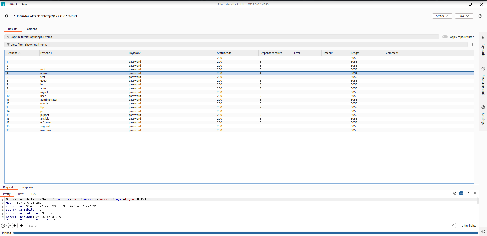

# Brute Force -> Low Security Level

```
For More information ->https://owasp.org/www-community/attacks/Brute_force_attack
```


## Let's try with Burp Suite


### ``` Send it to intruder ```
-Add payload position to Username and Password
-Select cluster bom attack


```The longest response received length represents the correct password and username```